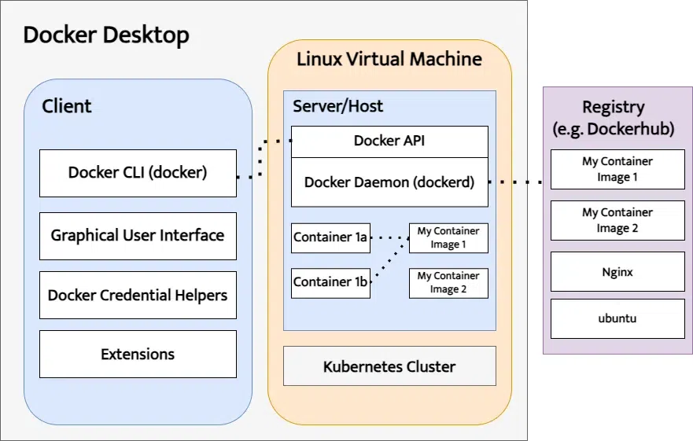

# Introduction to Containers and Docker

Welcome to the world of containers! This section will unveil the magic behind containerized applications and how Docker helps us manage them.

## What are Containers?

Imagine a shipping container. It's a standardized box that can hold all sorts of
cargo and be easily transported across different ships and trucks. Similarly, a
**container** in the software world is a standardized unit that packages an
application with all its dependencies (libraries, configurations) into a single,
lightweight unit.

Here's the analogy:

- **Application:** Your cargo (code, libraries)
- **Dependencies:** The packing materials (anything the application needs to run)
- **Container:** The shipping container (isolated environment)

This isolation ensures that applications run consistently regardless of the underlying operating system (OS) or environment.

It is recommended that you only want to run one application per container. However, in many local development setups you may also find that multiple related applications run within the single container e.g. nginx+php-fpm in LAMP stack.

## Benefits of Containerization

- **Portability:** Containers run seamlessly across different environments (Linux, Windows, Mac) without worrying about dependency conflicts.
- **Isolation:** Applications in separate containers don't interfere with each other, promoting stability and security.
- **Lightweight:** Containers share the host system's OS, making them much lighter than virtual machines.
- **Scalability:** Easily spin up or down containerized applications based on demand.
- **Reproducibility:**  The same container image guarantees consistent application behavior across deployments.

## Introduction to Docker

Docker is a popular platform for building, managing, and running containerized applications. It has several key components:

- **Docker daemon:**  A background service that manages container creation,
  running, and networking. [See also: [containerd](https://github.com/containerd/containerd)]
- **Docker client:**  The tool we use to interact with the Docker daemon (think
  of it as giving commands to the daemon). [See also: [nerdctl](https://github.com/containerd/nerdctl)]
- **Docker image:**  A blueprint or recipe that defines how a container is
  built. It contains the application code, libraries, and configurations. [See
  also: [OCI Image Specification](https://github.com/opencontainers/image-spec/blob/main/spec.md)]
- **Docker container:**  An instance of a running Docker image. It's like the
  actual running application within the isolated container.[See also:
  [runc](https://github.com/opencontainers/runc). [alternative Docker compatible
  runtimes](https://docs.docker.com/engine/alternative-runtimes/)]
- **Docker registry:**  A repository that stores and shares Docker images
  publicly (like Docker Hub) or privately within organizations. [See also: [OCI
  Registry](https://distribution.github.io/distribution/), [zot](https://github.com/project-zot/zot)]

## But, what is Docker Desktop?

To quote official documentation,
>Docker Desktop is a one-click-install application for your Mac, Linux, or Windows environment that lets you build, share, and run containerized applications and microservices.
>It provides a straightforward GUI (Graphical User Interface) that lets you manage your containers, applications, and images directly from your machine.

### Bonus: Use Cases Beyond Local Development

While Docker shines in local development, its reach extends far beyond:

- **Microservices Architecture:**  Break down large applications into smaller, independent services that can be containerized and deployed independently.
- **Continuous Integration & Delivery (CI/CD):**  Automate building, testing, and deployment pipelines using containerized environments.
- **Cloud Deployment:**  Deploy containerized applications to cloud platforms
  like AWS, Azure, or Google Cloud for scalability and agility.
- **Sandboxing**: Run untrusted files or programs in container for security and
  to keep your system clutter free.

This is just a glimpse into the exciting world of containers and Docker. You
just [play retro games](https://www.youtube.com/watch?v=LriUAmAkuD8) through it.
